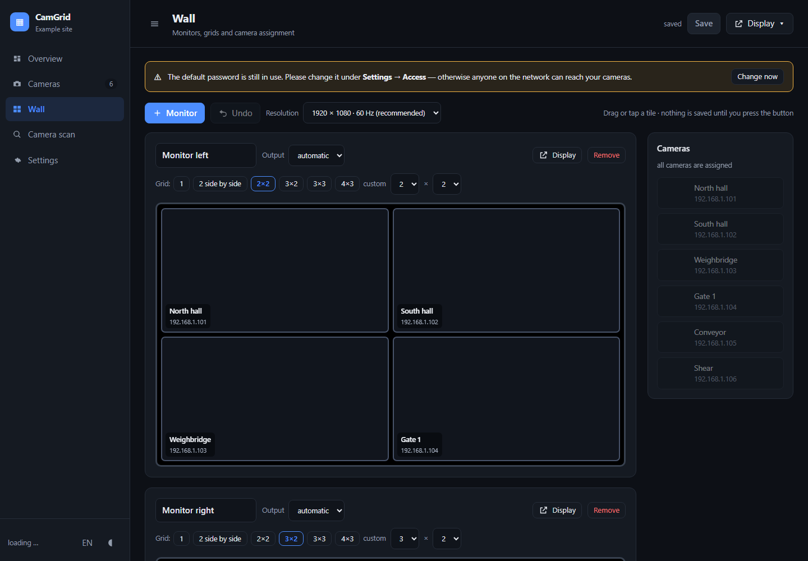
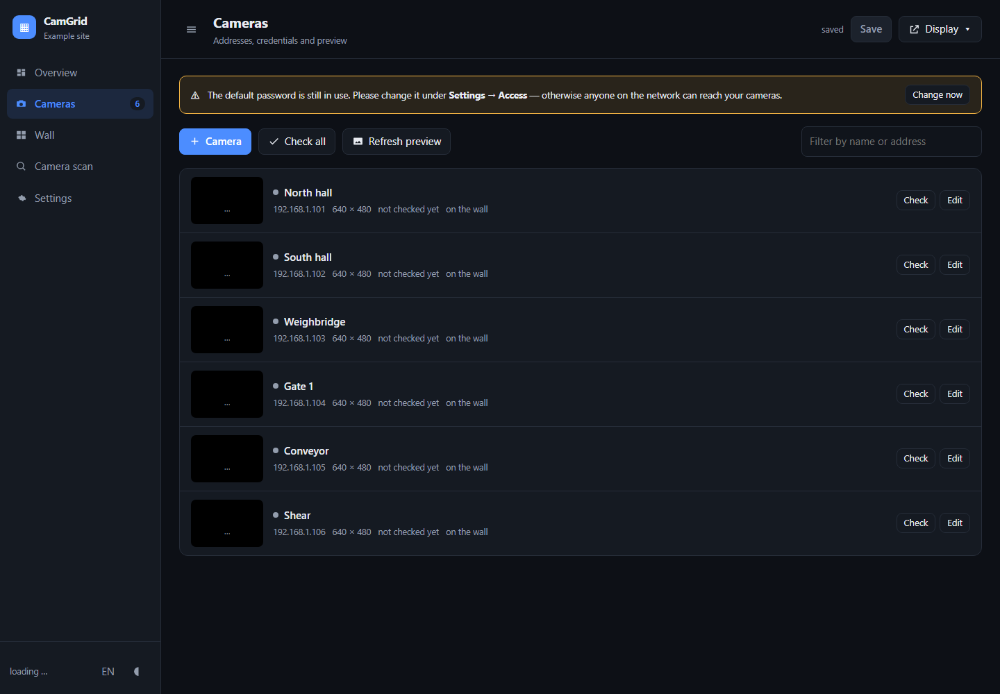
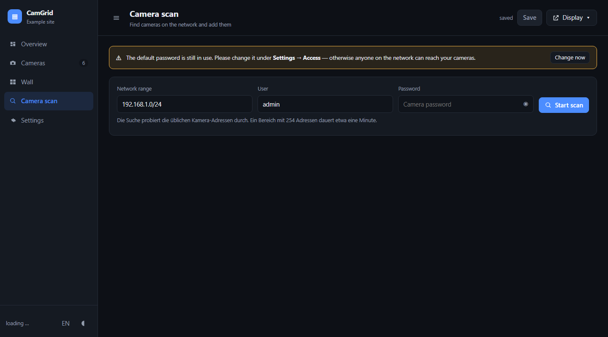

# CamGrid

**Many cameras, several monitors, one web interface.** CamGrid turns a Raspberry
Pi — or any other computer — into a video wall: scan your network for cameras,
arrange them on screens by drag and drop, done. No subscription, no cloud, no
account. Everything stays in your own network.

*Deutsche Anleitung: [README.de.md](README.de.md)*



---

## What it does

- **Finds cameras for you** — enter a network range and CamGrid does the rest:
  ONVIF discovery, port probing, and the usual RTSP paths are tried out. It ends
  up knowing resolution, codec and the right stream path. Or add a camera by
  hand: type the IP, CamGrid works out the rest.
- **Works with cameras that have no RTSP** — older models (classic Mobotix, for
  example) serve MJPEG over HTTP. CamGrid detects that and plays it.
- **Build the wall freely** — any number of monitors, grids from 1×1 to 6×6,
  tiles spanning several cells. The editor shows a 16:9 preview of the real
  screen before you save.
- **Easy to operate** — drag or tap, preview images everywhere, undo, English
  and German, light and dark, and nothing is saved until you press the button.
- **Runs on its own** — services start with the system and a watchdog restarts
  display windows that came up empty or crashed.
- **No extra software** — no Docker, no database, no Python packages. go2rtc
  ships with the project.

| Camera list | Network scan |
|---|---|
|  |  |

The interface speaks **English and German** — switch any time with the
**EN/DE** button in the sidebar. New browsers get English unless their system
language is German. The display page on the monitors follows the setting under
*Settings → Display → Language*.

## Installation

### Raspberry Pi and other Linux machines

```sh
git clone https://github.com/MrMurix/CamGrid.git
cd CamGrid && sudo ./install.sh
```

Or in a single command:

```sh
curl -fsSL https://raw.githubusercontent.com/MrMurix/CamGrid/main/netz-installation.sh | sudo sh
```

The installer adds missing packages (it handles apt, dnf and pacman itself),
sets up the services and opens the display after the next login. go2rtc is part
of the repository, so nothing is downloaded.

Useful flags: `--user NAME` (the user running the graphical session),
`--no-kiosk` (server only, no display), `--port N` (admin port),
`--dry-run` (show what would happen, change nothing), `--version`.
Remove it again with `sudo ./uninstall.sh`.

### Windows

```powershell
git clone https://github.com/MrMurix/CamGrid.git
cd CamGrid
powershell -ExecutionPolicy Bypass -File install.ps1
```

No administrator rights required. Remove with `-Uninstall`.

### macOS

```sh
git clone https://github.com/MrMurix/CamGrid.git
cd CamGrid && sudo ./install.sh
```

Services run through launchd. The installer does not set up a kiosk display
here; open the display page in a browser in full screen instead.

### Just try it, install nothing

```sh
./start-lokal.sh      # Linux and macOS
start-lokal.cmd       # Windows
```

Then open **http://127.0.0.1:8080**. To look at the interface with sample data
(invented cameras, separate ports, nothing touched), run `python3 demo.py`.

## First steps

1. Open the admin interface at `http://<address-of-the-device>:8080`
   Login: **admin / camgrid** — please change it right away under
   *Settings → Access*. The interface keeps reminding you until you do.
2. **Camera scan**: enter a network range such as `192.168.1.0/24` plus the
   camera password, scan, and take over what it found.
3. **Wall**: pick a grid, drag cameras into the tiles, press **Save**.
4. The monitors pick up the change by themselves within 15 seconds.

The display page for one monitor lives at `http://<address>:1984/?monitor=1`
(monitor 2 accordingly with `?monitor=2`).

## Requirements

- Python 3.11 or newer (included in Raspberry Pi OS and most Linux systems)
- For the display on the device itself: Chromium and a running desktop
- Cameras with RTSP (practically every IP camera) or MJPEG over HTTP;
  ONVIF helps with discovery but is not required
- `ffmpeg` is **optional** — resolution detection and preview images work
  without it

## How it is put together

| Part | Job |
|---|---|
| `app/server.py` | admin interface and JSON API (port 8080) |
| `app/config.py` | read, validate and store the configuration |
| `app/scan.py` | network scan (ONVIF, ports, vendor via MAC address) |
| `app/rtsp.py` | RTSP check in pure Python: resolution and codec without ffmpeg |
| `app/kamerabild.py` | preview image straight from the camera (HTTP, digest auth), MJPEG detection |
| `app/dienst.py` | starts and supervises go2rtc when there is no service manager |
| `app/streams.py` | derives `go2rtc.yaml` and `anzeige.json` from the configuration |
| `app/kioskinfo.py` | monitor details for the kiosk script |
| `web/admin/` | the admin interface (`sprache.js` holds every translated string) |
| `web/public/` | the display page shown on the monitors |
| `vendor/go2rtc/` | bundled go2rtc for ARM64, ARM, x86-64 and Windows |
| `scripts/kiosk.sh` | opens the display windows and supervises them |
| `install.sh`, `install.ps1`, `netz-installation.sh` | setup per operating system |
| `test/` | self tests, see below |

**Streaming** is done by [go2rtc](https://github.com/AlexxIT/go2rtc): it pulls
the RTSP streams and hands them to the browser as video, and it also serves the
display page on port 1984. The browser never talks to the cameras directly.

There is **one source of truth**: `config.json`. Everything else
(`go2rtc.yaml`, `anzeige.json`) is generated from it — editing those by hand
gets you nowhere.

| Path (Linux) | Contents |
|---|---|
| `/opt/camgrid` | program files |
| `/etc/camgrid/config.json` | the configuration (mode 600, contains passwords) |
| `/var/lib/camgrid/go2rtc.yaml` | generated, do not edit |
| `/var/log/camgrid/kiosk.log` | log of the display watchdog |

On Windows the configuration lives in `%LOCALAPPDATA%\CamGrid`.

## Commands

```sh
systemctl status camgrid-admin camgrid-go2rtc     # are the services running?
sudo systemctl restart camgrid-go2rtc             # restart the streams
/opt/camgrid/scripts/kiosk.sh --neustart          # reopen the display windows
tail -20 /var/log/camgrid/kiosk.log               # what the watchdog did
journalctl -u camgrid-admin -n 50                 # errors from the admin server
python3 -m app.scan 192.168.1.0/24 admin:password # scan without the web interface
```

## Self tests

```sh
python3 test/test_server.py                              # API, no cameras needed
python3 test/browsertest.py                              # clicks and drags in a real browser
python3 test/echttest.py 192.168.1.0/24 admin password   # against real cameras
python3 test/anzeigetest.py                              # display page: is video playing?
```

The browser test drives Chrome or Edge headless, expects a running
`start-lokal`, and picks up the credentials from `test/lokal/config.json`.

## Troubleshooting

| Symptom | Cause and fix |
|---|---|
| Camera found, but no video | Wrong user, password or stream path. Press **Check** in the camera list — it tells you what it found. |
| Camera answers, but port 554 is closed | Then it cannot do RTSP. CamGrid looks for an MJPEG stream over HTTP instead; if that fails, enter the camera's stream URL under **Full address** in the camera panel. |
| Picture looks green or purple | Chromium needs `--use-angle=gl`; `scripts/kiosk.sh` sets it. Add it if you start the browser yourself. |
| Monitors stay white | `tail /var/log/camgrid/kiosk.log`. The watchdog restarts empty windows within a minute. |
| Display stutters | Use the sub stream instead of the main stream (the scan suggests it) and set the monitors to 1920×1080 at 60 Hz. |
| "no response" although there is a picture | Reachability is probed on port 554. Cameras serving RTSP on another port do not show up there. |

## Lessons baked into this project

These cost real time in the predecessor project and are handled here already:

- **Chromium needs `--use-angle=gl`.** With the default `gles` the video comes
  out green and purple.
- **4K only runs at 30 Hz** on these screens. Monitors therefore default to
  1920×1080 at 60 Hz — the picture does not get worse, because the camera
  streams are smaller, but the machine has far less work.
- **Wait 15 seconds after boot.** Start Chromium too early and it gets stuck in
  disk I/O on slow SD cards, showing an empty white window.
- **Reset `exit_type`.** After a hard power-off Chromium believes it crashed and
  starts with an empty window.
- **Timestamp in the URL.** Otherwise Chromium shows the old page from cache
  after a change.
- **Sub stream, not main stream.** Eight 5-megapixel streams overload a Pi 5.
- **Supervise with a real criterion.** A running Chromium process does not mean
  a picture is on screen. The watchdog checks whether the page actually holds
  connections to the streaming service.
- **Unlock the keyring.** Otherwise a password dialog sits on a device that has
  no keyboard.
- **No ffmpeg needed.** `app/rtsp.py` reads resolution and codec straight from
  the stream, and preview images come from the camera's snapshot URL.

## Security

- The default login is **admin / camgrid**. Change it on first start.
- Camera passwords only live in `config.json` and `go2rtc.yaml` (both mode 600).
  The display page gets neither passwords nor camera addresses.
- Everything runs over HTTP inside the local network. For access from outside,
  put a VPN in front — do not expose the ports to the internet.

## Contributing

Bug reports and improvements are welcome. Before opening a pull request, please
run `python3 test/test_server.py` and, if the interface is involved,
`python3 test/browsertest.py`.

## License

MIT — see [LICENSE](LICENSE). Bundles [go2rtc](https://github.com/AlexxIT/go2rtc)
(MIT as well).
